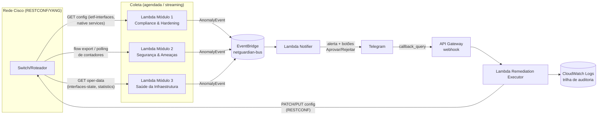

# Arquitetura — NetGuardian

## 1. Visão geral (event-driven, serverless)

**Por que Event-Driven Architecture (EDA):** os três módulos não conhecem o bot, e o bot não
conhece os módulos — o contrato é só o `AnomalyEvent` (ver `src/shared/models.py`). Isso permite:

- **Escalar horizontalmente** o número de detectores sem tocar no pipeline de notificação/remediação.
- **Testar cada módulo isoladamente** (um módulo só precisa saber produzir o evento certo).
- **Auditoria centralizada**: todo evento e toda decisão humana passam pelo mesmo barramento e pelo
  mesmo executor, o que facilita mapear para os controles de Gestão de Mudanças do ITIL v4 e de
  Log/Auditoria da ISO 27001 (A.8.15/A.5.36 na revisão 2022).

## 2. Contrato entre módulos: `AnomalyEvent`

Definido em `src/shared/models.py`. Campos principais:

- `module`: `compliance` | `threat` | `health`
- `severity`: `low` | `medium` | `high` | `critical`
- `device_id`, `interface` (quando aplicável)
- `finding`: descrição curta e legível por humano
- `evidence`: dict livre com os dados que embasaram a decisão (ex.: contadores CRC, score do
  Isolation Forest, porta/serviço inseguro encontrado)
- `proposed_action`: uma das ações em `src/bot/actions.py` (`ActionType`), com os parâmetros
  necessários para executá-la via RESTCONF
- `requires_approval`: bool — no MVP, tudo passa por HitL; o campo já deixa aberto um caminho de
  auto-remediação futura para achados de baixíssimo risco (ex.: só alertar, sem ação)

Isso é o que permite a frase da monografia "novos problemas de rede podem ser cobertos apenas
criando novas regras de IA e payloads no Python, sem alterar a estrutura na AWS": a infra
(EventBridge + API Gateway + o executor genérico) não muda; só se adiciona uma função que sabe
gerar `AnomalyEvent`s a partir de uma nova fonte de dados.

## 3. Módulo 1 — Compliance & Hardening (análise estática)

- **Fonte de dados:** `GET` via RESTCONF nos módulos YANG `ietf-interfaces` (para
  port security/ACLs aplicadas) e no *native model* da Cisco para serviços do dispositivo
  (`ip http server`, `transport input telnet`, etc. — representados como JSON em
  `src/module1_compliance/yang_payloads/`).
- **Lógica:** `src/module1_compliance/rules.py` — funções puras, testáveis, sem I/O:
  `check_port_security`, `check_qos_policy`, `check_insecure_services`. Cada regra retorna 0..N
  `Finding`s.
- **Por que regras determinísticas e não ML aqui:** compliance é uma verificação binária contra uma
  política conhecida (existe port-security? sim/não). Não há "normalidade estatística" a aprender —
  é o caso de uso certo para regras, e serve de contraste pedagógico com os Módulos 2 e 3 na
  monografia (nem todo problema de rede pede ML).

## 4. Módulo 2 — Segurança & Ameaças (análise dinâmica de tráfego)

- **Fonte de dados:** registros de fluxo agregados por (janela de tempo × host de origem) —
  simulados por `src/mocks/traffic_generator.py` no lugar de NetFlow/IPFIX real.
- **Feature engineering** (`src/module2_threats/feature_engineering.py`): por janela/host, calcula
  `unique_dst_ports`, `unique_dst_hosts`, `total_bytes`, `total_packets`, `avg_packet_size`,
  `syn_ratio`, `bytes_per_second`. Port scan tende a gerar `unique_dst_ports` alto com poucos bytes
  por conexão; exfiltração/DoS tende a gerar `bytes_per_second` muito acima da linha de base.
- **Modelo** (`src/module2_threats/model.py`): `IsolationForest` do scikit-learn — não supervisionado
  por design, porque tráfego anômalo é raro e não temos rótulos confiáveis em produção
  (justificativa acadêmica: aprendizado não supervisionado é apropriado quando a classe anômala é
  rara e não estacionária).
- **Avaliação** (`src/module2_threats/train.py`): como o gerador sintético sabe quais amostras são
  anômalas, o script calcula **precisão, recall, F1 e matriz de confusão** contra esse rótulo oculto
  — permitindo discutir falsos positivos/negativos na monografia com números reais, não anedota.
- **Classificação fina:** depois que o Isolation Forest marca uma amostra como anômala, uma
  heurística simples (`classify_anomaly` em `model.py`) decide se o padrão se parece mais com
  *port scan* (proposta: isolar host) ou *pico de tráfego* (proposta: rate-limit).

## 5. Módulo 3 — Saúde da Infraestrutura (telemetria)

- **Fonte de dados:** `GET` via RESTCONF no container `ietf-interfaces:interfaces-state` (histórico
  de `oper-status` amostrado periodicamente) e nas estatísticas de interface (contadores de erro,
  incluindo CRC).
- **Flapping** (`detect_flapping` em `telemetry_analysis.py`): conta transições
  up↔down dentro de uma janela deslizante; acima de um limiar → dampening (ou shutdown preventivo
  se persistir).
- **CRC drops** (`detect_crc_errors` em `telemetry_analysis.py`): calcula a taxa de crescimento do
  contador de erros CRC entre amostras (contadores são cumulativos em dispositivos Cisco) e compara
  com um limiar por segundo; acima do limiar → redirecionar tráfego para link de backup.

## 6. Human-in-the-Loop (`src/bot/`)

- `notifier` (em `src/shared/notifier/telegram_bot.py`) formata o `AnomalyEvent` em uma mensagem
  padronizada — mesmo template para os 3 módulos, o que sustenta a alegação de "experiência
  unificada": o engenheiro não precisa saber se o problema veio de config, tráfego ou telemetria
  para entender e decidir.
- Cada alerta tem botões inline `Aprovar` / `Rejeitar`. O callback do Telegram chega via webhook
  HTTPS no API Gateway (TLS em trânsito) e vai para `src/bot/telegram_webhook_handler.py`.
- `src/bot/actions.py::RemediationExecutor` traduz a `proposed_action` do evento em uma chamada
  RESTCONF concreta (PATCH no YANG correspondente) e guarda o **estado anterior** antes de aplicar,
  permitindo `rollback()` — mapeando diretamente para o requisito de Gestão de Mudanças (todo change
  tem plano de rollback) e para trilha de auditoria (ISO 27001).

## 7. AWS (serverless, tier gratuito)

- **AWS Lambda**: cada módulo, o notifier e o executor são funções independentes (ver
  `infra/template.yaml`).
- **API Gateway**: único endpoint HTTPS público, recebendo o webhook do Telegram.
- **EventBridge**: barramento de eventos central (`netguardian-bus`), com uma *rule* que roteia todo
  `AnomalyEvent` para o Notifier.
- **CloudWatch**: logs (trilha de auditoria) e métricas; `EventBridge Scheduler`/`CloudWatch Events`
  dispara periodicamente os Módulos 1 e 3 (polling), enquanto o Módulo 2 pode ser acionado por
  eventos (novo lote de flows em S3) ou também por agenda.
- **Custo/latência**: discutido no capítulo de nuvem da monografia — free tier da AWS cobre
  1M invocações Lambda/mês e 1M chamadas API Gateway/mês, suficiente para uma prova de conceito;
  a latência fria (cold start) de Lambdas Python é tipicamente <1s, aceitável para alertas (não é
  um caminho de dados em tempo real de milissegundos).

## 8. Mapeamento com os 5 eixos da monografia

1. **Engenharia de Redes & Telemetria** — Módulos 1 e 3 usam RESTCONF/YANG (`src/shared/
   restconf_client.py`) em vez de SNMP/CLI, permitindo dados estruturados (JSON) em vez de parsing de
   texto.
2. **IA & Ciência de Dados** — Módulo 2: pipeline completo (feature engineering → Isolation Forest →
   validação com precisão/recall/matriz de confusão) em `src/module2_threats/`.
3. **Engenharia de Software & NetDevOps** — arquitetura orientada a eventos, payloads JSON tipados
   (`dataclasses`), tratamento de exceção de rede em `restconf_client.py`, e rollback em
   `bot/actions.py`.
4. **Nuvem & Sistemas Distribuídos** — `infra/template.yaml` (Lambda + API Gateway + EventBridge),
   discussão de latência/custo acima.
5. **Cibersegurança & Governança** — HitL obrigatório neste MVP, trilha de auditoria via CloudWatch,
   webhook em TLS, e mapeamento explícito para ITIL v4 (Gestão de Mudanças) e ISO 27001 (Registro e
   Monitoramento, Gestão de Mudanças).

## Próximos passos

- Trocar o mock RESTCONF por um DevNet Sandbox real (Cisco Always-On IOS-XE) e validar os XPaths
  YANG usados em `rules.py`/`telemetry_analysis.py` contra o modelo real do dispositivo.
- Substituir `traffic_generator.py` por exportação NetFlow/IPFIX real ou por um dataset público
  (ex.: CIC-IDS) para validar o Isolation Forest fora do sintético.
- Adicionar autenticação/verificação de assinatura no webhook do Telegram (`secret_token`) —
  atualmente o handler já valida o token, mas isso deve ser reforçado com allow-list de IP do
  Telegram em produção.
- Métrica de custo real após primeiro deploy (`sam deploy`) para o capítulo de nuvem.
